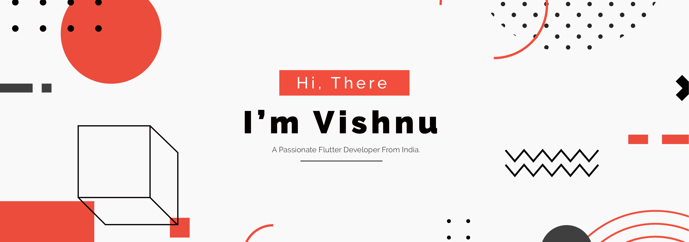

  

<!-- <h1 align="center">Hi 👋, I'm Vishnu</h1>
<h3 align="center">A passionate flutter developer from India</h3> -->

  

<!-- ### Hi 👋, I'm Vishnu
#### A passionate flutter developer from India -->

 

# About Me

- :computer: I’m a passionate **Flutter Developer**
- :keyboard: I’m currently working on **Personal projects**
- :speaking_head: Ask me about **Flutter, UI/UX Design**
- :email: Reach me @ **vishnumukundan77@gmail.com**
- :smile: Fun fact **I'm not graduated.**

 

### Connect with me:

 

### Language and Tools:

          

<!-- 

 -->

 

&nbsp;

<!-- 

 -->
